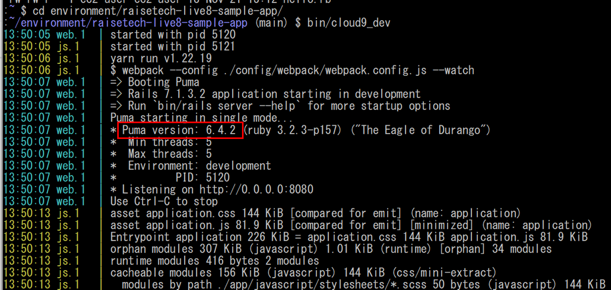
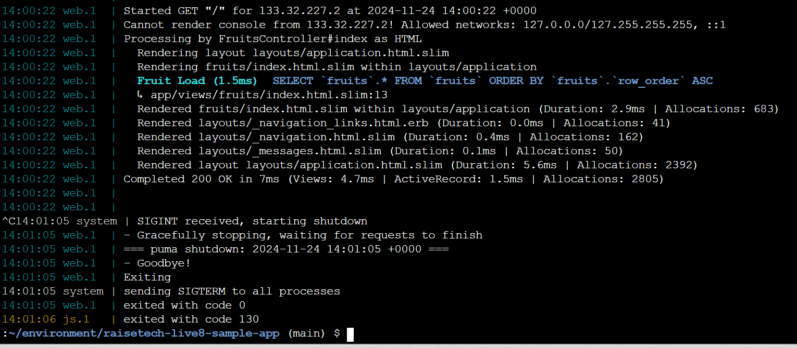
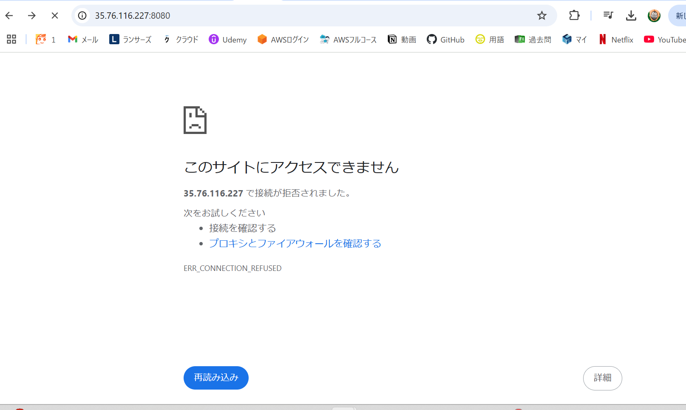
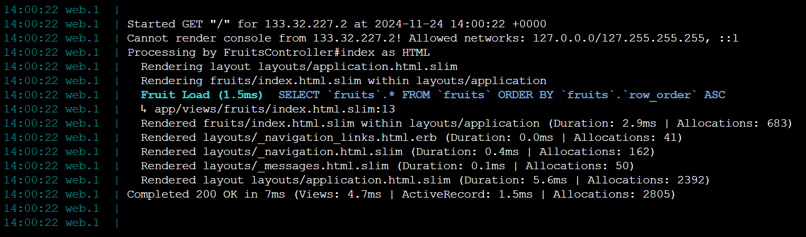
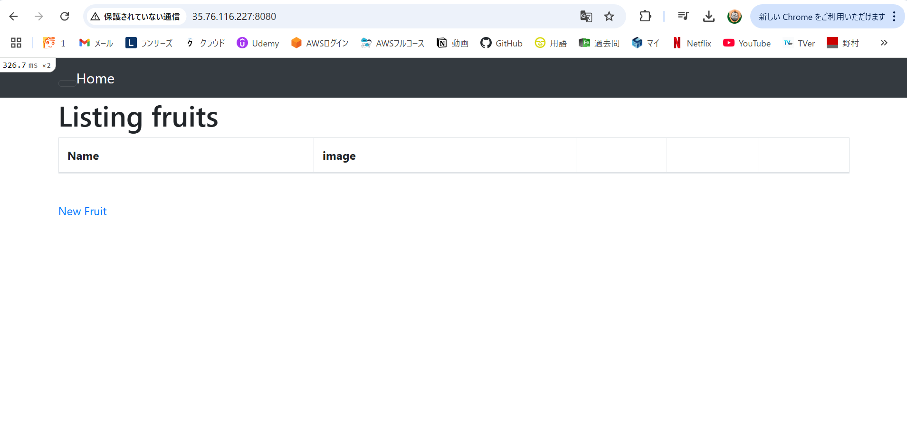
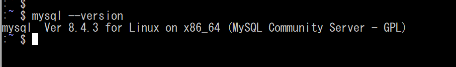
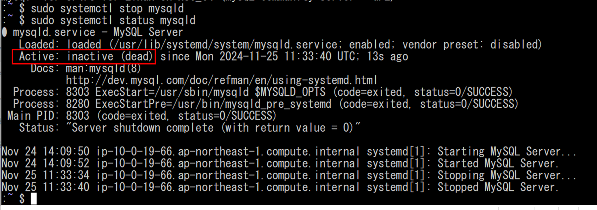
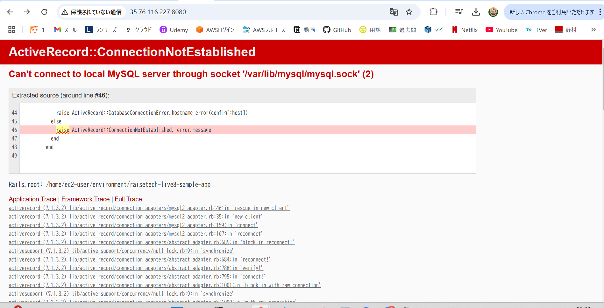

# APサーバについて調べる
* APサーバの名前とバージョンの確認

* APサーバを終了させた際、アクセスできるかの確認

アクセスできない

* APサーバを起動後、アクセスできるかの確認

アクセスできる

# DBサーバについて調べる
* DBサーバの名前とバージョンの確認

* DBサーバを終了させた際、アクセスできるかの確認

アクセスできない

* Railsの構成管理ツールの名前  
**Bundler**
# 講義を受けた感想
* サンプルアプリケーションということもあり、一番基礎的な内容であると思われましたが、やはりエラーは発生し、素直に動いてくれませんでした。

* コマンドにミスがないか、バージョンがあっているかなど基本的な確認、それ以外の場合はよく調べること、さらにAIなどを駆使して調べたりすることなど、いろんなアプローチをすることが大事だと今回課題を行って感じました。